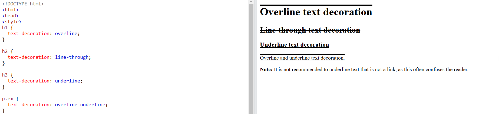
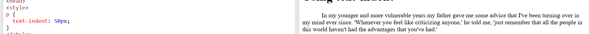
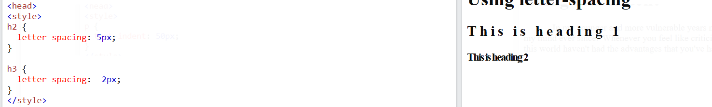
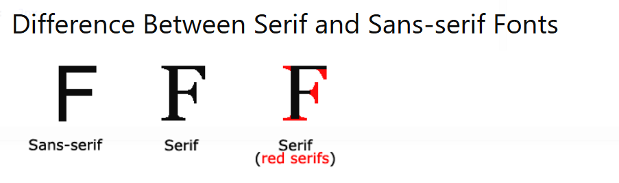
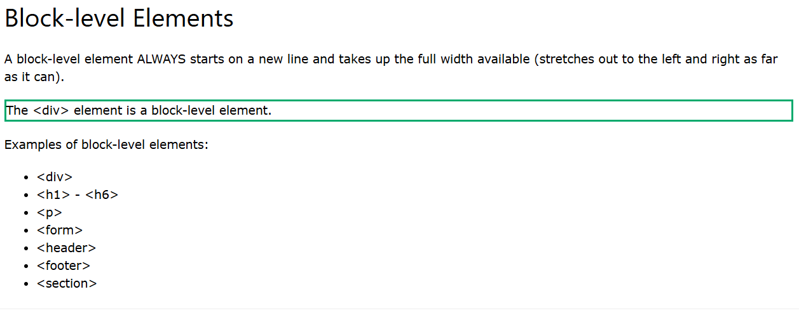
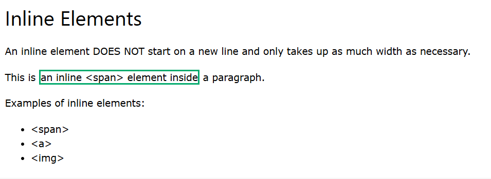
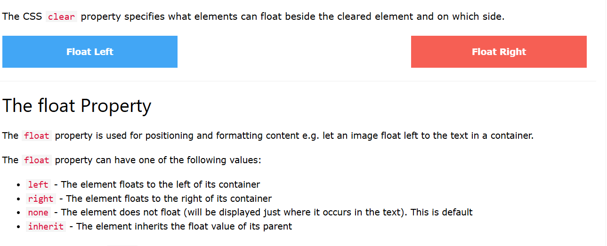
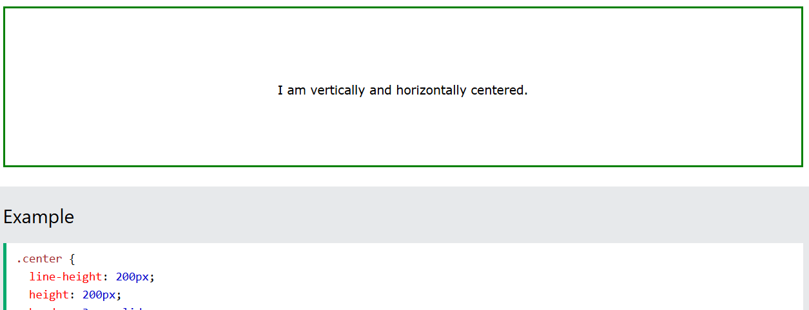
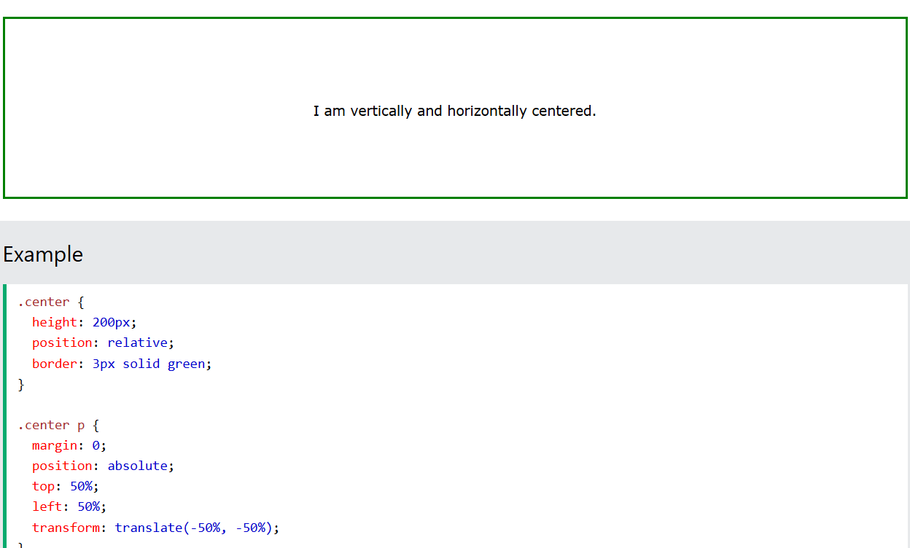

# margin Collapse

```css
h1 {
  margin: 0 0 50px 0;
}

h2 {
  margin: 20px 0 0 0;
}
```

# CSS height and width Values

## Các thuộc tính heightvà widthcó thể có các giá trị sau:

- auto- Đây là mặc định. Trình duyệt tính toán chiều cao và chiều rộng

- length- Xác định chiều cao/chiều rộng theo px, cm, v.v.

- %- Xác định chiều cao/chiều rộng theo phần trăm của khối chứa

- initial- Đặt chiều cao/chiều rộng thành giá trị mặc định

- inherit- Chiều cao/chiều rộng sẽ được kế thừa từ giá trị cha của nó

# CSS Text Decoration

- text-decoration-line
- text-decoration-color
- text-decoration-style
- text-decoration-thickness
- text-decoration
  

# CSS Text Spacing

- text-indent : thụt vào đầu dòng n pixel
  

- letter-spacing
  

# CSS Font



# Display\* Important

[Link tham khảo](https://www.w3schools.com/css/css_display_visibility.asp)

## Block



## Inline



## Hide an Element - display:none or visibility:hidden?

- Hidden display: none

Xóa luôn sự tồn tại của element ra khỏi dom

- visibility:hidden;

Ẩn element đó đi.

## CSS Layout - The position Property

There are five different position values:

- static : mặc định của tất cả HTML elements

- relative : element định vị theo trục x,y. Và mặc định theo static làm mốc để hiển thị element
- fixed : được định vị tương đối với viewport, nghĩa là nó luôn ở cùng một vị trí ngay cả khi trang được cuộn.
- absolute : phụ thuộc vào relative phần tử gần nhất. lấy phần tử đó làm gốc tọa độ

- sticky : kết hợp của fixed và relative.

# Overflow

- hidden: tắt thanh scroll

- auto: cho phép scroll

- scroll: phải scroll

- overflow-x: cuộn trục X
- overflow-y: cuộn trục y

# Float



# \*Display inline

## So sánh với inline-block

- inline cho phép xác định width height còn inline-block thì không

- inline không margin padding được còn inline-block thì có.

## So với display: block

- điểm khác biệt chính là display: inline-block không tự động xuống dòng. 2 phần tử inline tự động xuống dòng

# \*Center Align Elements

Kỹ thuật căn giữa phần tử nhanh.

Để căn giữa nhanh những block element (ví dụ thẻ div) -> dùng
`margin:auto`

Để căn giữa text -> dùng `text-align: center`

Để căn giữa `image` -> chuyển image sang dạng
`block element` ( dùng display block). Sau đó tiếp tục làm.

Có thể dùng position, trong một số trường hợp nhất định (như tạo 1 ảnh đè lên ảnh khác)

#### Center Vertically - Using line-height

1 trick để căn giữa nhanh chóng. `line-height bằng giá trị height`


#### Center bằng transform



#### Center bằng flexBox (easy- tự tìm hiểu)

# CSS Combinators

### Descendant combinator (space)
- Cú pháp: selector1 selector2
- Ý nghĩa: Chọn tất cả các phần tử selector2 nằm bên trong selector1, bất kể mức độ lồng nhau. Nói cách khác, selector2 là một phần tử con (trực tiếp hoặc gián tiếp) của selector1.
Ex:
```css
div p {
  background-color: yellow;
}
```
### Child combinator (>)
- Cú pháp: selector1 > selector2
- Ý nghĩa: Chọn chỉ các phần tử con trực tiếp của selector1, tức là chỉ các phần tử selector2 nằm ngay bên trong selector1, không chọn các phần tử ở các cấp lồng sâu hơn.
### Next sibling combinator (+)
- Cú pháp: selector1 + selector2
- Ý nghĩa: Chọn phần tử đầu tiên selector2 ngay sau selector1, nếu selector2 là "anh em" trực tiếp kế tiếp.
```css
h1 + p {
  color: blue;
}
```
Trong ví dụ này, thẻ p đầu tiên ngay sau thẻ h1 sẽ có màu xanh. Các thẻ p khác (nếu có) sau h1 sẽ không bị ảnh hưởng.
### Subsequent-sibling combinator (~)

- Cú pháp: selector1 ~ selector2
- Ý nghĩa: Chọn tất cả các phần tử selector2 xuất hiện sau selector1, nếu chúng là "anh em" cùng cấp. Tất cả các phần tử cùng loại selector2 theo sau selector1 sẽ được chọn, không chỉ là phần tử ngay tiếp theo.
```css
h1 ~ p {
  color: green;
}

```