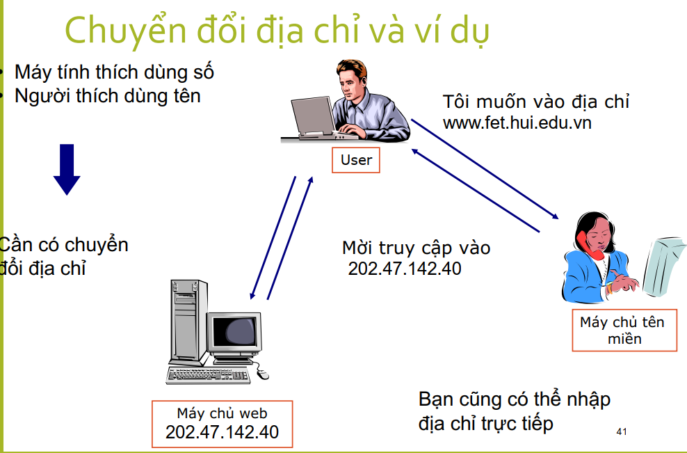
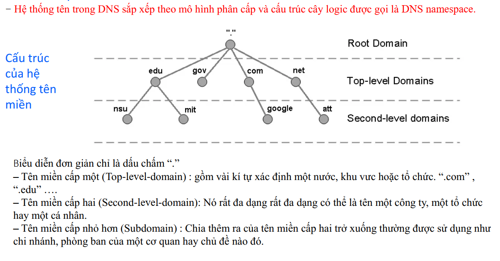

# Kiến trúc phân tầng trong MMT
Cấu trúc Kiến trúc phân tầng trong MMT mạng rất phức tạp. Rất nhiều thành phần:

•Máy trạm - hosts

•Định tuyến - routers

•Đường truyền - links

•Ứng dụng - applications

•Giao thức - protocols

•Phần cứng – hardware

•Phần mềm - software


# Giao thức TCP/IP




# KHẢO SÁT TIẾN TRÌNH PHÂN PHỐI GÓI TIN  - MẠNG LAN

### Địa chỉ lớp 2 - địa chỉ MAC.

- Định nghĩa: MAC (Media Access Control) Address là một địa chỉ duy nhất được gán cho mỗi thiết bị mạng, cho phép nó được nhận diện trong một mạng cục bộ.
- Cấu trúc: Địa chỉ MAC thường có định dạng 48 bit, thường được biểu diễn dưới dạng 6 cặp số hex (ví dụ: 00:1A:2B:3C:4D:5E).
- Chức năng: Địa chỉ MAC được sử dụng trong lớp liên kết dữ liệu của mô hình OSI để quản lý việc truyền tải dữ liệu giữa các thiết bị trong cùng một mạng. Nó giúp thiết bị xác định đúng đích đến của dữ liệu.

- Lớp 1 cung cấp môi trường vật lý và cách mã hóa.
- Thiết bị lớp 2 cung cấp cổng giao tiếp với môi trường
truyền vật lý.
- Lớp mạng cung cấp kết nối và chọn đường giữa 2 máy.
- Địa chỉ lớp 3 - địa chỉ IP.
- Trước khi một máy có thể gửi dữ liệu đến một máy khác,
nó phải biết địa chỉ MAC của máy đích.
- Nếu địa chỉ MAC không tìm thấy, ARP được sử dụng để
ánh xạ giữa địa chỉ lớp 2 - lớp 3.
- Truyền thông tin cậy cần sử dụng phiên TCP.
- Dữ liệu gửi phải được xác nhận bằng acknowledged.- Nếu máy đích thuộc mạng khác thì cần phải có một default
gateway.
- Một số công cụ khả dụng để kiểm tra kết nối giữa 2 máy :
ping
tracert
arp

# MẠNG WAN 
Mạng diện rộng là một mạng truyền dữ liệu mà
hoạt động trên một phạm vi địa lý rộng.


. Hệ thống này chia thành hai khu vực chính: mạng ngoại vi (Perimeter Network) và mạng nội bộ (Internal Network).

## Cấu trúc Hệ thống

### Mạng Ngoại Vi (Perimeter Network)

1. **External Client**
   - Thiết bị bên ngoài (máy tính, điện thoại) truy cập vào hệ thống.

2. **TLS (Transport Layer Security)**
   - Giao thức bảo mật mã hóa dữ liệu giữa các thiết bị, đảm bảo tính bảo mật và riêng tư.

3. **HTTP Reverse Proxy**
   - Máy chủ trung gian nhận yêu cầu từ client bên ngoài và chuyển tiếp đến các máy chủ bên trong. Bảo vệ máy chủ nội bộ khỏi các cuộc tấn công trực tiếp.

### Mạng Nội Bộ (Internal Network)

1. **Consolidated Access Edge Server**
   - Điểm truy cập vào mạng nội bộ, thực hiện chức năng xác thực, ủy quyền và kiểm soát truy cập.

2. **Director**
   - Điều phối và phân phối các yêu cầu đến các máy chủ khác trong hệ thống.

3. **Communicator Web Access**
   - Cung cấp dịch vụ truy cập web cho các ứng dụng nội bộ.

4. **Web Server**
   - Lưu trữ các trang web và ứng dụng web.

5. **Conferencing Servers**
   - Cung cấp dịch vụ hội nghị trực tuyến.

6. **Front-End Servers**
   - Xử lý các yêu cầu từ phía người dùng.

7. **Back-End SQL Server**
   - Cơ sở dữ liệu lưu trữ thông tin.

8. **Mediation Server**
   - Đóng vai trò trung gian trong việc truyền thông giữa các thiết bị.

9. **Group Chat Server**
   - Cung cấp dịch vụ chat nhóm.

10. **Media Gateway**
    - Cổng trung gian cho phép giao tiếp giữa các thiết bị khác nhau.

### Các Công Nghệ và Giao Thức

- **HTTPS (HTTP over SSL or TLS)**
  - Giao thức truyền siêu văn bản an toàn cho dữ liệu trên Web.

- **TLS**
  - Giao thức bảo mật để mã hóa các kết nối mạng.

- **MTLS (Mutual Transport Layer Security)**
  - Phiên bản nâng cao của TLS, yêu cầu xác thực lẫn nhau giữa máy chủ và client.

### Các Thành Phần Quan Trọng Khác

- **POOL**
  - Cụm máy chủ tập trung để tăng khả năng xử lý và độ tin cậy.

- **Internal Client**
  - Thiết bị bên trong mạng nội bộ (máy tính, laptop, điện thoại di động).

## Chức Năng Tổng Thể
Hệ thống cung cấp các dịch vụ web, hội nghị trực tuyến, chat nhóm và nhiều dịch vụ khác cho người dùng nội bộ và bên ngoài. Hệ thống đảm bảo tính bảo mật cao nhờ việc sử dụng các giao thức mã hóa như TLS và MTLS.

# Địa Chỉ IP

Địa chỉ IP được phân thành hai loại: **Private** và **Public**.

## 1. Địa Chỉ IP Private
- **Định nghĩa**: Địa chỉ IP private chỉ được sử dụng trong mạng nội bộ (mạng LAN) và không được định tuyến trên môi trường Internet. Điều này có nghĩa là các địa chỉ này có thể được sử dụng lặp đi lặp lại trong nhiều mạng LAN khác nhau mà không gây xung đột.
- **Dải địa chỉ private** (quy định trong RFC 1918):
  - **Lớp A**: `10.x.x.x`
  - **Lớp B**: `172.16.x.x` đến `172.31.x.x`
  - **Lớp C**: `192.168.x.x`

## 2. Địa Chỉ IP Public
- **Định nghĩa**: Địa chỉ IP public là địa chỉ sử dụng cho các gói tin đi trên môi trường Internet. Những địa chỉ này được định tuyến trên Internet và cần phải duy nhất cho mỗi host tham gia vào Internet.
- **Tính chất**: Địa chỉ public không thể được sử dụng lặp lại trong các mạng khác nhau và phải được cấp phát bởi các tổ chức quản lý địa chỉ IP.

# Các mô hình trong tầng ứng dụng

## Client - Server

## Peer to Peer

## Mô hình lai


# Dịch vụ và giao thức, cổng trong tầng ứng dụng


# DNS Namespace



# Project Proxy
# Load Balancer:

#### Mô tả:
 Xây dựng một load balancer đơn giản để phân phối yêu cầu của client đến các server khác nhau nhằm tăng hiệu suất.
#### Công nghệ: Node.js, Networking.
#### Học được: 
Load balancing, TCP connections, scaling servers.

# Proxy Server:

#### Mô tả: 
Xây dựng một proxy server đơn giản để định tuyến yêu cầu từ client đến server đích và trả kết quả về client. Dùng để hiểu cách thức một proxy hoạt động trong mạng.

#### Công nghệ: Node.js, Express, HTTP, Networking.

#### Học được:
 Cách hoạt động của proxy, forwarding HTTP requests, network performance.

# Web scraping proxy

```cmd
curl --proxy http://localhost:8080 "http://wttr.in/Paris?0"
```
